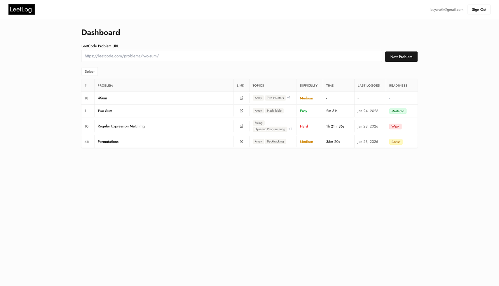

<p align="center">
  
</p>

<h1 align="center">LeetLog</h1>

<p align="center">
  <strong>Your personal journal for mastering algorithms.</strong>
</p>

<p align="center">
  <a href="https://github.com/telmenbayar/leetlog/blob/main/LICENSE">
    
  </a>
  <a href="https://www.leetlog.net">
    
  </a>
</p>

---

## Open Source

LeetLog is an **open source** project. We believe in transparency and community-driven development. Feel free to contribute, fork, or self-host!

## Features

- **Track LeetCode Problems** - Log problems you've solved with timestamps
- **Time Tracking** - Built-in timer to track how long each problem takes
- **Solution Logging** - Save your code solutions and notes
- **Progress Monitoring** - See your improvement over time
- **Expiration System** - Problems "expire" after 30 days to encourage re-practice

<div style="display: flex; justify-content: space-around; align-items: center;">
  
  
  
</div>

## Tech Stack

- **Framework**: Next.js 16
- **Database**: PostgreSQL with Prisma ORM
- **Authentication**: Supabase Auth
- **Styling**: Tailwind CSS
- **Deployment**: Vercel

## Getting Started

### Prerequisites

- Node.js 18+
- PostgreSQL database
- Supabase project (for auth)

### Installation

1. Clone the repository
   ```bash
   git clone https://github.com/telmenbayar/leetlog.git
   cd leetlog
   ```

2. Install dependencies
   ```bash
   npm install
   ```

3. Set up environment variables
   ```bash
   cp .env.example .env.local
   ```

4. Configure your `.env.local` with:
   ```
   DATABASE_URL=your_pooled_connection_string
   DIRECT_URL=your_direct_connection_string
   NEXT_PUBLIC_SUPABASE_URL=your_supabase_url
   NEXT_PUBLIC_SUPABASE_ANON_KEY=your_supabase_anon_key
   ```

5. Push the database schema
   ```bash
   npx prisma db push
   ```

6. Run the development server
   ```bash
   npm run dev
   ```

## Contributing

Contributions are welcome! Please feel free to submit a Pull Request.

## License

MIT

## Links

- [leetlog.net](https://www.leetlog.net)
